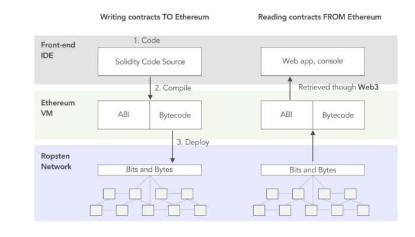

# Ethereum and Solidity: The Complete Developer's Guide

[Course Completed](https://www.udemy.com/certificate/UC-abd7ab96-f8ed-453e-9e0f-67eec086fb4a/)

## Takeaways

## 1. Learnt about the basics of the blockchain and smart contracts.

### Ethereum Transaction Object

- Nonce - How many times the sender has sent a transaction
- To - Address of account this money is going to
- Value - Amount of ether to send to the target address
- gasPrice - Amount of ether the sender is willing to pay per uni gas to get this transaction processed
- startGas/gasLimit - Units of gas that this transaction can consume
- V, r, s - Cryptographic pieces of data that can be used to generate the senders account address, generated from the sender’s private key.

### Transaction Process

- There are transactions that (i) take place from one wallet to another, and (ii) for contract deployment (does not have a 'to' address)
- Transaction gets sent to a node. Multiple transactions may happen add the same time, and they are compiled into a list (or block).
- The node applies a validation logic to the block.
- Data concat with Nonce = Output Hash -> Output hash as a base 10 number -> Check if it is less than a target value (e.g. 1000)
- Time taken to find a solution = Block time
- Target value is variable (raise to make easier and vice versa), depending on the previous block time.
- No. of nodes available that are mining are constantly changing, which is why the target value keeps changing.
- etherscan.io/chart/blocktime

### Gas

- Gas refers to the fee required to successfully conduct a transaction on Ethereum.
- London Upgrade:
  - Calculating the total transaction fee: Gas units (limit) \* (Base fee + Tip)
  - Base fee is calculated by the network based on demand for block space, which will be burnt
  - Tip will be used as a priority fee to compensate miners
  - Sender can set a max fee (`maxFeePerGas`) to set a maximum amount to pay for the transaction to execute and not worry about overpaying "beyond" the base fee when the transaction is executed.

### Smart Contract Properties

1. Running contract functions

| Calling a function                | Sending a transaction to a function                  |
| --------------------------------- | ---------------------------------------------------- |
| Cannot modify the contract’s data | Can modify a contract’s data                         |
| Can return data                   | Takes time to execute                                |
| Returns instantly and free        | Returns the transaction hash (or ID) and is not free |

2. Any function invocation will create a "msg" object:

   1. msg.data
   2. msg.gas = Amount of gas the current function invocation has available
   3. msg.sender = address of account that started the current function invocation
   4. msg.value = Amount of ether (in wei) that was sent along with the function invocation

3. Solidity syntax to note:

   - [Useful link on smart contracts](https://ethereum.org/en/developers/docs/smart-contracts/anatomy/)
   - Array Reference Types
     - Fixed array: Fixed length and must be a single type of element. Creating a fixed array: int[3], bool[2]
     - Dynamic arrays: Can change in size over time, but only contains a single type of element.Create a dynamic array: int[] , bool[]
   - Mapping: Collection of key value pairs (dictionary). All keys must be the same type, and all values must be of the same type.
     - mapping(string => string)
     - mapping(int => bool)
   - Struct: Collection of key value pairs that can have different types. e.g. struct Car { string make; string model; uint value;}

   - Solidity: Can create nested Dynamic Arrays
   - ABI/JS/ Web3 world: Cannot receive nested dynamic array. This means arrays of strings cannot be transferred to JS.
   - Storage vs Memory:

     - Storage: Persistent data is referred to as storage and is represented by state variables. These values get stored permanently on the blockchain. You need to declare the type so that the contract can keep track of how much storage on the blockchain it needs when it compiles.
     - Memory: Values that are only stored for the lifetime of a contract function's execution are called <b>memory</b> variables. Since these are not stored permanently on the blockchain, they are much cheaper to use.

   - Your function needs:
     - parameter variable and type (if it accepts parameters)
     - declaration of internal/external
     - declaration of pure/view/payable
     - returns type (if it returns a value)

4. Ethereum App Architecture

   - Server: Sends HTML doc/JS assets to frontend (typically for reading from the block chain)
   - Client: If user wants to make a change to the blockchain, front end connects to web3, which connects to metamask, and execute transaction on the Ethereum network. Writing of data to blockchain MUST be done from the client side, public/private key will not be accessed by server.

5. Smart contract code will be comiled by compiler into EVM (ethereum virtual machine) bytecode and a Contract Application Binary Interface (ABI)
   - EMV Bytecode is an executable code on EVM
   - Contract ABI is an interface to interact with EVM bytecode.
   - E.g. If you want to call a function in a smart contract with your JavaScript code, ABI plays a role as an intermediary between your JavaScript code and EVM bytecode to interact with each other.

## 2. Developed a lottery web application that uses React (front end) and Solidity (smart contract creation):

- Allows a "manager" to create a lottery game
- Allows users to contribute Eth to a lottery pool
- Allows the manager to disperse the pooled Eth to a random participant.

## 3.Kickstart web app to solve the problem of malicious agents who create kickstarters and run away with the money without producing any product at all

- Allow a manager to create a kickstarter "campaign"
- Allow users to contribute Eth to a campaign
- Allow managers to make funding requests, where he takes eth from the campaign to pay a vendor for product development
- For funding request to be approved, at least half of all contributors must "approve" the request
- Once half of all contributes approve request, the manager can finalise the request, which sends eth to the vendor for product development.
